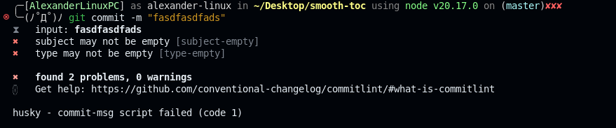

# Commit conventions

## cz-git

Se recomienda revisar [cz-git](https://cz-git.qbb.sh/guide/), a continuación las instrucciones para instalarlo global

```
npm install -g cz-git commitizen

echo '{ "path": "cz-git", "$schema": "https://cdn.jsdelivr.net/gh/Zhengqbbb/cz-git@1.10.1/docs/public/schema/cz-git.json" }' > ~/.czrc
```

- Se puede añadir configuración como emojis configurando el archivo ~/.czrc creado en el segundo comando.

```bash
g add .
g cz
```

## husky y commitlint

Se añade una segunda validación del correcto uso de conventional commits.

```
npm install @commitlint/cli @commitlint/config-conventional --save-dev

touch .commitlintrc.json
nano .commitlintrc.json
```

Dentro del archivo configurar de la siguiente manera.

```JSON
{
  "extends": ["@commitlint/config-conventional"],
  "rules": {
    "header-max-length": [1, "always", 80],
    "body-max-line-length": [2, "always", 80],
    "subject-min-length": [2, "always", 5],
    "type-enum": [
      2,
      "always",
      [
        "build",
        "ci",
        "chore",
        "docs",
        "feat",
        "fix",
        "perf",
        "refactor",
        "revert",
        "style",
        "test",
        "merge"
      ]
    ]
  }
}

```

Seguido se configura el husky, como sigue:

```
npx husky init
echo "npx --no -- commitlint --edit \$1" > .husky/commit-msg
rm  ./husky/pre-commit
```

- Con los pasos realizados se tiene un verificador de commits funcional.



# Trabajo en el proyecto

```
bun i framer-motion zustand @kuma-ui/core modern-normalize
bun i -D @kuma-ui/vite
bun i -D prettier @ianvs/prettier-plugin-sort-imports
bun i hast mdast rehype-react rehype-slug remark-frontmatter remark-gfm remark-parse remark-rehype unified unist-util-visit
bun i yaml
```
